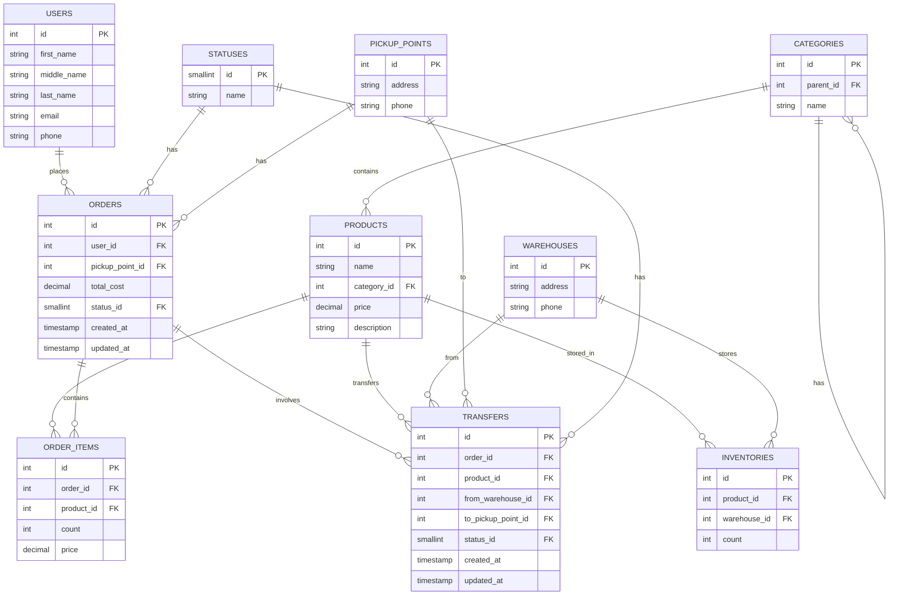

# Databases

Содержит конфигурации и скрипты для баз данных.

`postgresql/` — настройки и скрипты для PostgreSQL.\
`mongodb/` — настройки и скрипты для MongoDB.

ER-диаграмма БД в postgresql:

```mermaid
erDiagram
    USERS {
        int id PK
        string first_name
        string middle_name
        string last_name
        string email
        string phone
    }

    STATUSES {
        smallint id PK
        string name
    }

    PICKUP_POINTS {
        int id PK
        string address
        string phone
    }

    WAREHOUSES {
        int id PK
        string address
        string phone
    }

    CATEGORIES {
        int id PK
        int parent_id FK
        string name
    }

    PRODUCTS {
        int id PK
        string name
        int category_id FK
        decimal price
        string description
    }

    ORDERS {
        int id PK
        int user_id FK
        int pickup_point_id FK
        decimal total_cost
        smallint status_id FK
        timestamp created_at
        timestamp updated_at
    }

    ORDER_ITEMS {
        int id PK
        int order_id FK
        int product_id FK
        int count
        decimal price
    }

    INVENTORIES {
        int id PK
        int product_id FK
        int warehouse_id FK
        int count
    }

    TRANSFERS {
        int id PK
        int order_id FK
        int product_id FK
        int from_warehouse_id FK
        int to_pickup_point_id FK
        smallint status_id FK
        timestamp created_at
        timestamp updated_at
    }

    USERS ||--o{ ORDERS : places
    STATUSES ||--o{ ORDERS : has
    PICKUP_POINTS ||--o{ ORDERS : has
    CATEGORIES ||--o{ PRODUCTS : contains
    CATEGORIES ||--o{ CATEGORIES : has
    PRODUCTS ||--o{ ORDER_ITEMS : includes
    ORDERS ||--o{ ORDER_ITEMS : contains
    PRODUCTS ||--o{ INVENTORIES : stored_in
    WAREHOUSES ||--o{ INVENTORIES : stores
    ORDERS ||--o{ TRANSFERS : involves
    PRODUCTS ||--o{ TRANSFERS : transfers
    WAREHOUSES ||--o{ TRANSFERS : from
    PICKUP_POINTS ||--o{ TRANSFERS : "to"
    STATUSES ||--o{ TRANSFERS : has
```